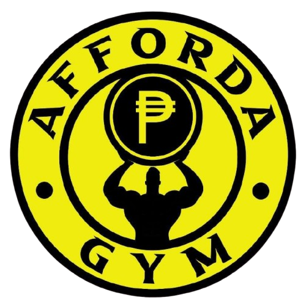

<div align="center">

  

  # **FordaGO**
  ### *Smart Gym Management & Interactive Fitness Platform*

  <p align="center">
    <b>A full-stack, real-time fitness ecosystem connecting Gym Members, Coaches, and Staff into one unified digital gym experience.</b>
  </p>

  <p align="center">
    <a href="#-core-modules"></a>
    <a href="#-technology-stack"></a>
    <a href="#-technology-stack"></a>
    <a href="#-technology-stack"></a>
    <a href="#-technology-stack"></a>
    <a href="#-license"></a>
  </p>

  <sub>Bachelor of Science in Information Technology — Capstone Project<br>Nueva Ecija University of Science and Technology (NEUST), San Isidro Campus</sub>

</div>

---

## 📌 Project Summary

**FordaGO** is an end-to-end gym digitalization platform engineered to streamline fitness operations, eliminate manual paper logs, and provide interactive training assistance. The system empowers gym-goers with personal workout tracking and direct coaching consultations while equipping gym owners with automated QR attendance, inventory control, and real-time financial reporting.

---

## 🏛️ Core Modules & Experience

```
                           ┌───────────────────────────────┐
                           │      FordaGO Ecosystem        │
                           └──────────────┬────────────────┘
                                          │
         ┌────────────────────────────────┼────────────────────────────────┐
         │                                │                                │
         ▼                                ▼                                ▼
┌──────────────────┐            ┌──────────────────┐            ┌──────────────────┐
│   MEMBER APP     │            │   COACH STUDIO   │            │   ADMIN PANEL    │
│  (Mobile Portal) │            │   (Trainer Hub)  │            │ (Command Center) │
└────────┬─────────┘            └────────┬─────────┘            └────────┬─────────┘
         │                               │                               │
         ├─ PR Metric Tracker            ├─ Trainee Roster Management    ├─ QR Attendance Scanner
         ├─ Split Routine Planner        ├─ 1-on-1 Real-Time Chat        ├─ Pass Verification
         ├─ Equipment QR Scanner         ├─ Workout Plan Proposals       ├─ Shop POS & GCash Audit
         ├─ Supplement Shop & GCash      ├─ Public Group Fitness Classes ├─ Equipment Catalog & QRs
         └─ Interactive App Tour Guides  └─ Weekly Availability Slots    └─ PDF/Excel Export Engine
```

---

### 📱 1. Member Mobile Portal
* **Personal Record (PR) Milestones:** Record bench press, deadlift, and squat metrics with automated percentage gain calculators and progress badges.
* **Weekly Split Planner:** Plan daily workouts (Monday to Sunday) with time duration targets (Min/Hrs), gym floor locations (Floor A/Floor B), and custom exercise builders.
* **Interactive QR Equipment Scanner:** Scan physical QR codes posted on gym machines to instantly view machine photo previews, targeted muscle highlights, and proper exercise execution tutorials.
* **Real-Time Trainer Chat:** Message personal trainers with live read receipts, instant typing updates, and direct workout plan proposals.
* **Shop & Supplement Orders:** Add pre-workouts, proteins, and gym apparel to cart with checkout via Counter Cash or GCash reference verification.
* **Guided Feature Onboarding:** Auto-centering interactive spotlights that guide new members step-by-step without blocking UI controls.

---

### 🏋️ 2. Coach Studio
* **Client Roster & Request Dispatch:** Review incoming trainee coaching requests and manage active personal training clients.
* **In-Chat Workout Proposals:** Send structured exercise routines with scheduled dates, time, price, and target muscles directly into the chat for 1-tap client acceptance.
* **Group Fitness Classes:** Create public fitness classes with participant limits, schedules, and live roster tracking.
* **Availability Management:** Set weekly recurring coaching hours and working days.
* **Trainer Financial Insights:** Track completed client sessions and estimated monthly coaching earnings.

---

### 🛡️ 3. Admin Command Center
* **Digital QR Turnstile & Attendance:** Instant camera scanner to log member daily check-ins with anti-pass-sharing timestamp verification.
* **Membership Pass Management:** Activate, monitor, and extend 30-day Premium Passes or Daily Visit passes.
* **Shop Orders Fulfillment & Stock Reconciliation:** Verify GCash reference numbers or cash payments, approve orders, and automatically deduct warehouse inventory.
* **Equipment Management & QR Placard Generator:** Register gym equipment and download printable QR code stickers for gym equipment placement.
* **Coach Account Administration:** Register certified gym coaches and manage credentials.
* **Data Analytics & Reports:** Instant export of attendance traffic, sales revenue, and inventory stock to PDF and Excel spreadsheets.

---

## 🛠️ Technology Stack

| Domain | Technology | Purpose |
| :--- | :--- | :--- |
| **Mobile & Web Client** | **Ionic 8 + Angular** | Hybrid mobile UI (Android / iOS) with standalone components |
| **Styling & Theming** | **SCSS + CSS Custom Properties** | Theme-aware interface (Dark fitness mode & Crisp white admin) |
| **Backend REST API** | **Laravel 11 (PHP 8.2+)** | Token authentication (Sanctum), business logic, and API routes |
| **Real-Time WebSockets** | **Laravel Reverb + Echo** | Sub-second real-time chat, unread notifications, and live status sync |
| **Database** | **MySQL / MariaDB** | Relational data persistence with strict foreign key constraints |
| **Hardware & Devices** | **Capacitor + Barcode Scanner** | Native device access for mobile camera QR scanning |
| **Reporting Engine** | **jsPDF + AutoTable** | Client-side vector PDF report generation and CSV/Excel exports |
| **Deployment / Cloud** | **Docker + Nginx** | Production containerization and reverse proxy routing |

---

## ⚡ Quick Start (Local Development)

### 1. Backend Setup (Laravel API & WebSockets)

```bash
# Enter backend directory
cd backend

# Install dependencies & initialize environment
composer install
cp .env.example .env
php artisan key:generate

# Run migrations and seed default demo accounts
php artisan migrate --seed

# Launch Laravel API server
php artisan serve --host=0.0.0.0 --port=8000
```

*In a separate terminal, start the Reverb WebSocket engine:*
```bash
cd backend
php artisan reverb:start --host=0.0.0.0 --port=8080
```

---

### 2. Frontend Setup (Ionic / Angular)

```bash
# Enter frontend directory
cd frontend

# Install Node dependencies
npm install

# Start local dev server
npm start
```

Access the app in your browser at: `http://localhost:4200`

---

### 🚀 3. One-Click 1-LAN Launcher (Windows)

To launch all servers simultaneously and test the app on your mobile phone over local Wi-Fi:

```cmd
# Double click the batch runner in the root folder:
start-dev-lan.bat
```
*Auto-detects your local IP address and boots Backend, Reverb, Queue Worker, and Frontend in separate windows.*

---

## 👥 Demo Access Accounts

| Role | Email | Panel / Route |
| :--- | :--- | :--- |
| **Admin** | `admin@email.com` | `/admin` |
| **Coach** | `coach.alex@email.com` | Mobile Header → Coach Studio |
| **Member** | `carl.bernaldo@email.com` | `/dashboard` |

---

## 📚 Capstone Documentation Index

* 📑 **[Capstone Defense Practical Guide](./docs/CAPSTONE_DEFENSE_PRACTICAL_GUIDE.md)** — Presentation talking points and live demo checklist.
* 🛡️ **[Defense Strategy](./docs/DEFENSE_STRATEGY.md)** — Panel Q&A strategy and system architecture defense.
* 🎬 **[Demo Script Quick Ref](./docs/DEMO_SCRIPT_QUICK_REF.md)** — Step-by-step role-by-role live presentation guide.
* ⚙️ **[System Documentation](./docs/SYSTEM_DOCUMENTATION.md)** — Database schemas, API endpoints, and WebSocket channels.
* 🐳 **[Podman & Docker Deployment Guide](./DEPLOYMENT_GUIDE_PODMAN.md)** — Containerized VPS deployment manual.

---

## 🔮 Future Enhancements

1. **Smart Wearables Integration:** Sync heart rate, calories, and active workout duration via Apple HealthKit and Google Health Connect.
2. **AI Computer Vision Form Coach:** Real-time pose estimation to analyze lifting technique and provide audio posture cues.
3. **Automated Turnstile Hardware:** Microcontroller-driven physical gate integration via relay triggers upon QR scan.

---

## 📜 Intellectual Property & License

This project is developed solely for academic capstone presentation and gym management evaluation. All rights reserved. Unauthorized reproduction, modification, or commercial distribution is strictly prohibited.

© 2026 Delwin Galang & FordaGO Capstone Team.
