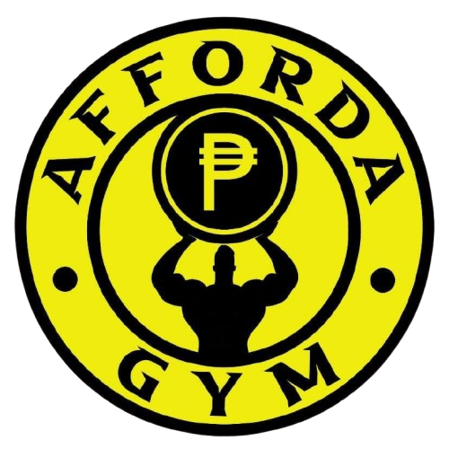

<div align="center">

  

  # **FordaGO: Mobile-Based Gym Database Management System**
  ### *AFFORDA Gym – Cabiao Branch*
  **Cabiao, Nueva Ecija**

  <p align="center">
    <b>A full-stack, real-time gym management platform connecting Gym Members, Coaches, and Administrative Staff into one unified digital fitness ecosystem.</b>
  </p>

  <p align="center">
    <a href="#-core-modules"></a>
    <a href="#-technology-stack"></a>
    <a href="#-technology-stack"></a>
    <a href="#-technology-stack"></a>
    <a href="#-technology-stack"></a>
    <a href="#-license"></a>
  </p>

  <p align="center">
    <a href="https://app.affordagym.com/"><b>🌐 Live Web App (PC / Laptop / iOS Safari / Chrome)</b></a> &nbsp;•&nbsp; 
    <a href="https://github.com/galangdelwin71-ctrl/FordaGo/raw/main/apk/fordago_latest.apk"><b>📲 Download Android APK (.apk)</b></a> &nbsp;•&nbsp;
    <a href="./docs/chapters/FORDAGO_MOBILE-BASED_GYM_DATABASE_MANAGEMENT_SYSTEM.docx"><b>📄 Download Full Capstone Manuscript (.docx)</b></a>
  </p>

  <sub>Bachelor of Science in Information Technology (BSIT) — Capstone Research<br>College of Information and Communications Technology (CICT)<br><b>Nueva Ecija University of Science and Technology (NEUST)</b>, San Isidro Campus</sub>

</div>

---

## 📌 Project Summary

**FordaGO** is an end-to-end gym database management and mobile application platform engineered to modernize daily fitness operations, eliminate manual paper logbooks, deliver optical camera-based QR attendance, provide on-demand machine exercise tutorials, and facilitate real-time coach-trainee collaboration. Developed specifically for **AFFORDA Gym – Cabiao Branch** (located in Cabiao, Nueva Ecija), the system empowers members with personal workout tracking and direct coach messaging, while providing gym administrators and reception personnel with automated attendance logging, supplement inventory control, point-of-sale transactions, and vector PDF/Excel analytical reporting.

---

## 🏛️ System Architecture Framework

```
========================================================================================
                     TIER 1: PRESENTATION LAYER (USER CLIENT TOUCHPOINTS)
========================================================================================
  [ Gym Member Mobile App ]   [ Fitness Coach Studio ]   [ Front-Desk Tablet Kiosk ]   [ Admin Command Center ]
    Android Phone (APK)         Android Phone (APK)         Android Tablet Kiosk         PC / Laptop Web Portal
    • Attendance QR Pass        • Trainee Progress Lists    • Optical Camera Scanner     • Member & Account Mgmt
    • Workout & PR Tracker      • Custom Plan Proposals     • Sub-500ms Check-In         • Inventory & POS Sales
    • Machine QR Tutorials      • 1-on-1 Real-Time Chat     • Walk-In Registration       • Financial Audits
    • Supplement Shop (Demo)    • Coaching Availability     • OTC Cash Confirmation      • PDF / Excel Analytics
                                            │
                                            ▼
========================================================================================
             COMMUNICATION CHANNEL: LINUX CLOUD VPS (app.affordagym.com)
========================================================================================
     HTTPS RESTful API Endpoints (Sanctum Tokens)   ◄──────►   WSS WebSockets (Laravel Reverb)
                                            │
                                            ▼
========================================================================================
             TIER 2: APPLICATION & BUSINESS LOGIC LAYER (LARAVEL 11 API)
========================================================================================
  [ Security & RBAC ]    [ QR Scanner Engine ]   [ Workout Engine ]   [ POS & Shop Engine ]   [ Real-Time Reverb ]
  • Sanctum Token Auth   • Optical QR Parsing    • Split Routines     • Counter Stock Deduct  • WebSocket Host
  • Bcrypt Password Hash • Anti-Duplication Check• PR Milestone Logs  • Cash Verification     • Duplex Chat
  • 4 System Roles       • Daily Timestamps      • Exercise Guides    • Sales Audit Records   • PDF/Excel Exporter
                                            │
                                            ▼
========================================================================================
               TIER 3: DATA PERSISTENCE LAYER (MYSQL 8.0 RELATIONAL DB)
========================================================================================
    8 Core Normalized Tables (Third Normal Form - 3NF) with Strict Referential Foreign Keys:
    users  •  memberships  •  attendances  •  equipment  •  workout_proposals  •  products  •  orders  •  chat_messages
========================================================================================
```

---

## 💡 Operational Context & Technical Delimitations

To maintain academic transparency, technical honesty, and alignment with real-world gym operations at AFFORDA Gym – Cabiao Branch, the following parameters are established:

1. **Front-Desk Hardware (Android Tablet Kiosk):**
   * There is no permanent desktop computer at the gym's reception counter. The reception check-in station is deployed on a recommended **Android Tablet Kiosk** mounted at the front desk, utilizing its built-in camera for optical QR scanning.
   * Full cross-platform management is simultaneously supported on any PC or laptop web browser via the live domain DNS (`https://app.affordagym.com`).
2. **Payment Processing & Interactive Demo Checkout:**
   * **Actual Payment Fulfillment:** All official payments for gym memberships, daily entrance passes, and counter supplement purchases are handled physically via **Over-the-Counter (OTC) cash** at the reception desk with manual staff receipt verification.
   * **Simulated GCash Checkout:** The mobile app features an interactive simulated GCash payment demo (with payment QR display and reference code submission) for user experience evaluation. It **does NOT deduct actual funds** from user bank or e-wallet accounts, avoiding corporate payment gateway merchant registration fees (PayMongo/Maya) that exceed student capstone budgets.
3. **Mobile Platform Deployment (Android APK vs. iOS Web):**
   * **Android:** Distributed as a standalone Android Application Package (`.apk`) compiled via Android Studio and Gradle, allowing free direct sideloading and manual installation on member and staff devices.
   * **Apple iOS (iPhone/iPad):** Apple strictly prohibits direct package (IPA) sideloading without App Store distribution, which requires an annual $99 USD Apple Developer Program fee and macOS hardware beyond academic research budgets. However, **iOS users are fully supported** via mobile web browsers (Apple Safari, Google Chrome) accessing `https://app.affordagym.com`, providing complete functional parity.

---

## 📱 Core System Modules

### 1. Gym Member Mobile Portal (Android APK / Web)
* **Contactless QR Attendance:** Generate personal dynamic QR check-in passes with instant verification and attendance history.
* **Personal Record (PR) Tracker:** Log benchmark lifts (Bench Press, Deadlift, Squat) with automatic percentage progress tracking.
* **Weekly Workout Split Builder:** Create and customize routine schedules across training days and target muscle splits.
* **Optical Equipment QR Scanner:** Scan printed QR code labels on gym machinery to view photo demonstrations, targeted anatomical muscle diagrams, and step-by-step instructional tutorials.
* **Real-Time Coach Consultation:** Exchange 1-on-1 messages with certified gym coaches with instant read receipts and interactive in-chat workout plan proposals.
* **Supplement Store:** Browse available gym products and supplements with simulated checkout and counter cash pickup.

### 2. Coach Studio (Trainer Hub)
* **Trainee Roster Management:** Review assigned trainees, monitor lifting PR milestones, and review exercise workout histories.
* **In-Chat Workout Plan Proposals:** Send structured, customized exercise plans directly into the chat stream for 1-tap client approval.
* **Coaching Schedule & Availability:** Set working days, consultation hours, and trainer specialization bios.

### 3. Front-Desk Tablet Kiosk & Administrative Command Center
* **Optical QR Attendance Scanner:** Camera-based QR attendance station for sub-500ms check-in validation and daily entry logging.
* **Membership Pass Management:** Register walk-in gym-goers, activate 30-day membership passes, and monitor expiry dates.
* **Supplement POS Inventory:** Track product stock levels in real time, record counter cash sales, and verify submitted payments.
* **Equipment Catalog & QR Generator:** Manage gym machinery details and generate printable QR code labels for physical machine placement.
* **Vector PDF & Excel Reporting:** Instant generation of administrative attendance logs, sales audits, and inventory summaries.

---

## 🛠️ Technology Stack Specification

| Layer / Domain | Technology | Specification / Purpose |
| :--- | :--- | :--- |
| **Frontend Framework** | **Ionic 8 + Angular 18** | Cross-platform mobile & responsive web UI with standalone components |
| **Language (Client)** | **TypeScript 5+ & SCSS** | Strongly-typed client logic, dynamic routing, and dark/light fitness theme |
| **Backend Framework** | **Laravel 11 (PHP 8.2+)** | RESTful MVC architecture, Eloquent ORM, and Sanctum token security |
| **Real-Time Engine** | **Laravel Reverb & Echo** | WebSocket server on port 8080 for instant duplex chat and notifications |
| **Database Engine** | **MySQL 8.0** | Third Normal Form (3NF) relational schema with strict foreign keys |
| **Mobile Runtime** | **Capacitor 6** | Native Android bridge for camera hardware and optical barcode scanning |
| **Cloud Hosting** | **Ubuntu Linux VPS** | Hosted on live production server with reverse proxy at `app.affordagym.com` |
| **Reporting Tools** | **jsPDF + AutoTable** | Client-side dynamic vector PDF report rendering and CSV/Excel data exports |

---

## ⚡ Local Development Setup

### 1. Backend Setup (Laravel API & WebSockets)

```bash
# Navigate to backend
cd backend

# Install PHP dependencies
composer install

# Set up environment configuration
cp .env.example .env
php artisan key:generate

# Execute database migrations and seed default test data
php artisan migrate --seed

# Launch Laravel REST API server
php artisan serve --host=0.0.0.0 --port=8000
```

*In a secondary terminal, start the Laravel Reverb WebSocket server:*
```bash
cd backend
php artisan reverb:start --host=0.0.0.0 --port=8080
```

---

### 2. Frontend Setup (Ionic 8 & Angular 18)

```bash
# Navigate to frontend
cd frontend

# Install Node modules
npm install

# Start local development server
npm start
```

*Access the local web app at: `http://localhost:4200`*

---

## 👥 Default Demo Accounts

| Role | Email | Password | Access Interface |
| :--- | :--- | :--- | :--- |
| **Admin** | `admin@email.com` | `password` | `/admin` (Web Command Center) |
| **Front-Desk Staff**| `staff@email.com` | `password` | `/frontdesk` (Tablet Kiosk / POS) |
| **Coach** | `coach.alex@email.com` | `password` | Mobile Navigation → Coach Studio |
| **Member** | `carl.bernaldo@email.com`| `password` | `/dashboard` (Member Mobile App) |

---

## 📚 Capstone Research & Thesis Documentation

The complete academic manuscript and research artifacts are organized under the [`docs/chapters/`](./docs/chapters/) directory:

* 📥 **[Complete Official Capstone Manuscript (.docx)](./docs/chapters/FORDAGO_MOBILE-BASED_GYM_DATABASE_MANAGEMENT_SYSTEM.docx)** — Full manuscript containing all Preliminaries, Chapters 1–4, References, 27 Signed Appendices, and Curriculum Vitae.
* 📖 **[Chapter I: The Problem and Its Background (Markdown)](./docs/chapters/chapter-1.md)** — Research background, TAM/Codd/Fielding frameworks, IPO Model, Statement of the Problem, Significance, Delimitations, and RRL.
* 🔬 **[Chapter II: Research Methodology (Markdown)](./docs/chapters/chapter-2.md)** — 6-Phase Agile SDLC, Cabiao research locale, purposive sampling (35 respondents: 5 IT Experts, 5 Staff/Coaches, 25 Members), and ISO/IEC 25010 4-point Likert scale.
* 📊 **[Chapter III: Results and Discussion (Markdown)](./docs/chapters/chapter-3.md)** — 4-Tier Architecture, Use Case Diagram, Context Diagram Level 0, DFD Level 1, 3NF Normalization, ERD (8 Core Tables), Implementation Environment, and Evaluation Ratings (IT Experts: 3.75, Staff/Coaches: 3.84, Members: 3.82).
* 📑 **[Chapter IV: Summary, Conclusions, and Recommendations (Markdown)](./docs/chapters/chapter-4.md)** — Synthesis of quality findings, research conclusions, and future commercial recommendations (Apple Developer Program enrollment, commercial payment gateways, AI posture models).
* 📋 **[Survey Questionnaire Instrument](./docs/research/SURVEY_QUESTIONNAIRE.md)** — Official 20-item ISO/IEC 25010 evaluation instrument.
* 🛡️ **[System Defense Reviewer](./docs/defense/DEFENSE_STRATEGY.md)** — Presentation talking points, panelist defense questions, and live demo guide.
* 📂 **[Database Defense Guide](./docs/database/FORDAGO_DATABASE_STRUCTURE_AND_DEFENSE_GUIDE.md)** — Full schema dictionary, table relationships, and foreign key definitions.

---

## 👥 Capstone Researchers & Proponents

**Bachelor of Science in Information Technology**  
*College of Information and Communications Technology (CICT)*  
**Nueva Ecija University of Science and Technology (NEUST) – San Isidro Campus**

* **BERNALDO, CARL ANDREW B.**
* **GALANG, DELWIN F.**
* **JAVIER, JAYLEE T.**
* **MEDINA, ETHAN JEROME G.**
* **PONGCO, RYZA MAE M.**

---

## 📜 Intellectual Property & License

Developed solely for academic evaluation and gym management operation. All rights reserved.  
© 2026 Delwin Galang & the FordaGO Research Team.
