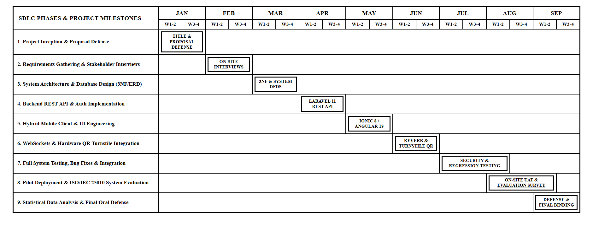

# Chapter III: Results and Discussion

## Chapter III

Results and Discussions

This chapter presents the comprehensive results, technical outcomes, and empirical findings obtained from the design, development, and evaluation of FordaGO: Mobile-Based Gym Database Management System for AFFORDA Gym – Cabiao Branch. It details the execution of the Agile Software Development Life Cycle (SDLC), the complete system models (Use Case, Context Diagrams, Normalization, ERD, and Data Dictionary), and the statistical analysis of the software quality evaluation based on the ISO/IEC 25010 standard administered to IT experts, gym staff, coaches, and members.

1. Development of FordaGO: Mobile-Based Gym Database Management System for AFFORDA Gym – Cabiao Branch

The design and development of the FordaGO system followed the structured stages of the Agile System Development Life Cycle (SDLC), ensuring that all functional, technical, and operational requirements of AFFORDA Gym – Cabiao Branch were systematically implemented and verified.

1.1. Planning Phase

The planning phase established the foundational scope, feasibility, and technical direction of the FordaGO project. The researchers conducted preliminary site visits, workflow evaluations, and stakeholder consultations at AFFORDA Gym – Cabiao Branch in Cabiao, Nueva Ecija.

Problem Identification and Feasibility

The investigation confirmed that the gym was experiencing severe operational delays due to manual paper logbooks for attendance tracking, difficulty in tracking membership pass expirations, absence of on-demand equipment orientation for beginner gym members, manual supplement inventory tracking, and lack of a structured digital channel connecting personal trainers and trainees.

The technical, operational, and economic feasibility of the proposed mobile-based solution was established:

Technical Feasibility: Modern Android smartphones and front-desk tablet devices equipped with cameras and web browsers provide the necessary hardware environment for optical QR code scanning, real-time WebSocket communication, and responsive kiosk/mobile interfaces without requiring expensive specialized desktop workstations or physical turnstiles. Furthermore, because FordaGO is hosted live on a Linux Cloud VPS with configured domain DNS, the administrative portal can be accessed seamlessly across mobile tablets and desktop web browsers alike.

Operational Feasibility: Gym staff, personal trainers, and members expressed strong readiness to adopt a mobile application that simplifies daily check-in, routine management, supplement ordering, and coaching consultations.

Economic Feasibility: Eliminating physical paper ledgers and automating inventory records prevents revenue leakage, reduces administrative supply costs, and maximizes staff efficiency.

Resource Allocation and Risk Management

The researchers identified the necessary software tools (Laravel 11, Ionic 8, Angular, MySQL, Laravel Reverb, Visual Studio Code), hardware and cloud assets (Linux Cloud Virtual Private Server, member Android smartphones, front-desk Android tablet kiosks, and optional administrative PC web browsers via live domain DNS), and potential deployment risks. Mitigation strategies included implementing local storage fallback and inlined vector exercise guides to handle transient network interruptions, Bcrypt password hashing and Sanctum token guards for data security, and conducting user onboarding orientations.

Project Schedule and Timeline

The project followed the Agile Software Development Life Cycle (SDLC) for AFFORDA Gym – Cabiao Branch, covering the developmental activities from project planning in January 2026 through system design, coding, testing, deployment, and user evaluation in preparation for the Final Oral Defense in October 2026, as outlined in the Gantt chart in Figure 4.

> **Figure 4. Gantt Chart of Activities for FordaGO System Development (January–October 2026)**

1.2. Designing Phase

The designing phase transformed the functional requirements gathered during planning into technical architecture diagrams, entity-relationship models, process flows, and user interface wireframes.

### System Architecture

The system architecture follows a decoupled Client-Server Model consisting of:

1. Presentation Layer (Frontend):

Engineered using Ionic 8 and Angular standalone components to deliver a unified, cross-platform client architecture. This layer accommodates three primary operational touchpoints: (a) the native Android mobile application distributed via APK for gym members and accredited coaches, (b) the front-desk digital kiosk interface operating on touch-screen Android tablets (or reception PCs) at the front desk, and (c) the responsive web application portal accessible to desktop PCs, laptops, and Apple iOS devices (via Apple Safari or Google Chrome) over the live domain DNS (https://fordago.online). Due to academic capstone budget constraints, the requirement for an annual $99 USD Apple Developer Program subscription, and Apple's strict policies prohibiting direct sideloading of iOS packages outside the App Store, iOS users utilize this live responsive web interface, providing responsive browser access to core gym workflows without requiring native App Store deployment.

2. Application Logic Layer (Backend):

Laravel 11 (PHP 8.2+) RESTful API server implementing MVC design patterns, Eloquent ORM, and Sanctum token middleware.

3. Real-Time Communication Layer:

Laravel Reverb WebSocket Server integrated with Laravel Echo for instant duplex messaging, live typing status, and proposal notifications.

4. Data Persistence Layer:

MySQL 8.0 relational database management system enforcing strict referential integrity and automated backup protocols: Scheduled automated daily MySQL database dumps (mysqldump) to preserve member transaction histories and attendance audit records. The comprehensive software engineering stack, integrated libraries, and cloud infrastructure powering the system are presented in Table 8 and the Full-Stack Architectural Framework in Figure 5.

> **Table 8. Full-Stack Layered Architecture and Technology Stack of FordaGO**

> **Figure 5. FordaGO Full-Stack Architectural Framework**

### Use Case Diagram

Role-Based Access Control and System Actors

To maintain strict operational accountability, safeguard sensitive financial records, and prevent unauthorized privilege escalation, FordaGO implements a multi-tier Role-Based Access Control (RBAC) architecture grounded in the Principle of Least Privilege (PoLP) and Separation of Duties (SoD) in alignment with ISO/IEC 27001 data security guidelines. Rather than treating administrative personnel as a homogeneous group, the system implements defense-in-depth access governance across three architectural strata:
1. **Database Persistence Layer:** Schema-level role partitioning is enforced by the `users.role` MySQL ENUM column (`'super_admin'`, `'admin'`, `'employee'`, `'coach'`, `'user'`), ensuring that role identities are immutable across foreign-key relationships.
2. **Backend Application Layer:** All incoming HTTP requests require a cryptographically signed Laravel Sanctum bearer token. Every protected API route is wrapped in custom role-validation middleware (`EnsureUserHasRole`), which verifies the authenticated token's role against permissible parameters (`middleware('role:admin,super_admin')` vs `middleware('role:admin,super_admin,employee')`). Any unauthorized route access immediately terminates with an `HTTP 403 Forbidden` response and generates a security event in the audit trail.
3. **Frontend Presentation Layer:** Angular standalone route guards (`adminGuard`, `managerGuard`, `memberGuard`, `authGuard`) and dynamic template structural directives (`*ngIf="!isEmployee"`, `*ngIf="canManageCoaches"`, `*ngIf="isSuperAdmin"`) dynamically adapt the interface, suppressing restricted navigation tabs, control actions, and management buttons.

The system formally classifies all authenticated stakeholders into five (5) distinct operational roles across three (3) functional tiers:

### Administrative Governance Tier (Super Admin, Gym Admin, Front-Desk Staff)

To eliminate ambiguity during institutional defense and illustrate clear business governance, the three administrative roles are strictly differentiated by business ownership, managerial authority, and front-line operational duties:

#### 1. Super Administrator (`super_admin` — Gym Proprietor / Executive Authority):
* **Organizational Role & Business Domain:** Represents the executive gym proprietor and system licensee. The Super Administrator holds supreme, unrestricted authority over the digital infrastructure and strategic configuration of the enterprise.
* **Distinct Capabilities & Responsibilities:**
  * **Global Role Provisioning:** The sole authority capable of creating, assigning roles to, updating, or deleting Gym Administrator (`admin`) and Front-Desk Employee (`employee`) accounts.
  * **System Configuration & Security Governance:** Manages global application settings, payment gateway integration credentials, and business operating rules.
  * **Unrestricted Security Audit Inspection:** Full read-only oversight of the system audit trail (`activity_logs`), inspecting user IP addresses, session logins/logouts, failed authentication attempts, and data modification events.
  * **Database Disaster Recovery:** Oversees automated database backup jobs, manual SQL snapshot downloads, and database migration routines.
* **Operational Restrictions:** None. Possesses root executive authority across the entire platform.

#### 2. Gym Administrator (`admin` — Branch Manager / Operational Authority):
* **Organizational Role & Business Domain:** Functions as the on-site general manager of AFFORDA Gym – Cabiao Branch, overseeing day-to-day business viability, staff supervision, and customer satisfaction without technical server access.
* **Distinct Capabilities & Responsibilities:**
  * **Coach Account Lifecycle Management:** Sole administrative manager authorized to onboard, verify credentials, edit rates, and manage schedules for Accredited Gym Coaches via `/api/admin/coaches`.
  * **Executive Financial Analytics & Vector Reporting:** Full access to the Management Reporting Engine (`/reports/admin/*`), generating dynamic daily, weekly, monthly, and yearly vector PDF audit documents and Excel spreadsheets covering gross revenue, attendance turnover, supplement retail sales, and inventory valuation.
  * **Member Account Overrides & Pass Approvals:** Authorizes offline counter cash payments, manually overrides membership plan status (e.g., activating 30-day Premium Passes upon receipt verification), and resolves customer disputes.
  * **Retail Inventory Oversight:** Manages the supplement catalog, adjusting retail selling prices, entering wholesale supplier costs, and monitoring profit margins.
  * **Staff Account Management:** Authorized to create and manage Front-Desk Employee (`employee`) accounts.
* **Operational Restrictions & Boundaries:**
  * Strictly **prohibited from creating, editing, or deleting Super Administrator accounts**.
  * Strictly **restricted from accessing server-level environment configurations (`.env`)** or database disaster recovery routines.
  * Strictly **prohibited from truncating or altering system security audit logs**.

#### 3. Front-Desk Employee (`employee` — Receptionist / Frontline Cashier):
* **Organizational Role & Business Domain:** Frontline customer-facing staff stationed at the gym entrance reception desk, dedicated to rapid ingress validation, retail transactions, and walk-in customer intake.
* **Distinct Capabilities & Responsibilities:**
  * **Optical QR Entrance Check-In:** Operates the counter tablet kiosk camera scanner to validate entering member QR codes, instantly confirming active pass status and logging entry timestamps.
  * **Walk-In Member Intake:** Ingests personal details of walk-in customers and creates standard regular member (`user`) accounts in the system.
  * **Daily Pass Counter Payment Confirmation:** Receives cash payments for walk-in Daily Passes (₱40.00) and marks payments as confirmed in the attendance roster.
  * **Point-of-Sale (POS) Retail Sales:** Processes over-the-counter cash sales of supplement beverages and fitness merchandise, triggering immediate database inventory deductions.
  * **Equipment Defect Flagging:** Submits maintenance tags and operational condition reports for malfunctioning exercise equipment.
* **Operational Restrictions & Least-Privilege Safeguards:**
  * **Strictly Blocked from Management Reports (`HTTP 403 Forbidden`):** Protected by `managerGuard` in Angular and `role:admin,super_admin` in Laravel. Front-desk staff cannot view financial reports, revenue summaries, net profit figures, or high-level business analytics.
  * **No Visibility of Supplier Costs or Profit Margins:** Can view retail prices for selling purposes but cannot inspect wholesale cost prices or margin calculations.
  * **Cannot Manage Coaches:** The Coaches management tab is completely hidden and guarded against employees.
  * **Cannot Manage Administrative Accounts:** Cannot create, modify, or delete any Employee, Admin, or Super Admin accounts.
  * **No Access to Security Audit Logs:** Cannot inspect the system audit trail or activity history.

---

### Client Services Tier (Gym Coach and Gym Member)

#### 4. Accredited Gym Coach (`coach` — Certified Fitness Trainer):
Operates within the Coach Studio workspace. Coaches can view their active trainee client rosters, configure weekly working availability schedules, conduct real-time duplex chat via Laravel Reverb WebSockets, formulate customized 1-on-1 Workout Plan Proposals, and schedule group fitness classes. Coaches are restricted from all administrative, financial, and inventory management modules.

#### 5. Gym Member (`user` — End-User Patron):
End-users accessing the mobile client portal. Members can monitor active pass duration, scan the official gym entrance QR code using their device camera for instant attendance check-in, scan equipment printed QR code labels for instructional movement tutorials, log personal workout sets and Personal Record (PR) benchmarks, browse the supplement shop catalog, checkout cart orders, and consult with accredited coaches. Members are strictly confined to their own personal data records.

---

### Role-Based Access Control Privilege Matrix

Table 1 formally defines the role-based capability boundaries, API route protections, and functional permissions across all five system roles, demonstrating the practical enforcement of least privilege:

> **Table 1. User Role and Access Privilege Matrix of FordaGO**

| Functional Module & Operational Capability | Backend Route & Middleware Guard | Super Admin (Owner) | Gym Admin (Manager) | Front-Desk Staff | Gym Coach (Trainer) | Gym Member (User) |
| :--- | :--- | :---: | :---: | :---: | :---: | :---: |
| **System Configuration & Role Provisioning** | | | | | | |
| Create / Delete Super Admin Accounts | Server Console / Database Ledger | ✓ | ✗ | ✗ | ✗ | ✗ |
| Create / Edit Gym Administrator Accounts | `POST/PUT /api/users` (Super Admin Only) | ✓ | ✗ | ✗ | ✗ | ✗ |
| Create / Edit Front-Desk Employee Accounts | `POST/PUT /api/users` (`role:admin,super_admin`) | ✓ | ✓ | ✗ | ✗ | ✗ |
| Register Walk-In Member (`user`) Accounts | `POST /api/users/create` (`role:admin,super_admin,employee`) | ✓ | ✓ | ✓ | ✗ | ✗ |
| Self-Registration via Mobile App | `POST /api/auth/register` (Public) | ✗ | ✗ | ✗ | ✗ | ✓ |
| **Security Audit & Disaster Recovery** | | | | | | |
| Inspect Security Activity Logs (Audit Trail) | `GET /api/admin/activity-logs` (`role:admin,super_admin`) | ✓ | ✓ | ✗ | ✗ | ✗ |
| Automated Database Backups & Recovery | Server Scheduled Jobs & CLI Backup Engine | ✓ | ✗ | ✗ | ✗ | ✗ |
| 2-Factor Authentication & Biometric Login | `/api/auth/2fa/*`, `/api/auth/biometric/*` | ✓ | ✓ | ✓ | ✓ | ✓ |
| **Gym Entrance & Attendance Monitoring** | | | | | | |
| Optical Camera Scan of Entrance QR Code | `POST /api/attendance/checkin` (Member Camera) | ✗ | ✗ | ✗ | ✗ | ✓ |
| Front-Desk Kiosk Scanner Check-In | `POST /api/attendance/checkin` (Kiosk Camera) | ✓ | ✓ | ✓ | ✗ | ✗ |
| View Live Daily Attendance Roster | `GET /api/attendance/today` (`role:admin,super_admin,employee`) | ✓ | ✓ | ✓ | ✗ | ✗ |
| Confirm Cash Payment for Daily Pass (₱40) | `PUT /api/attendance/{id}/confirm` (`role:admin,super_admin,employee`) | ✓ | ✓ | ✓ | ✗ | ✗ |
| View Personal Attendance History | `GET /api/attendance/my` (Sanctum Auth) | ✗ | ✗ | ✗ | ✗ | ✓ |
| **Membership & Pass Management** | | | | | | |
| Approve / Upgrade 30-Day Premium Pass (₱500) | `PUT /api/users/{id}/membership` (`role:admin,super_admin,employee`) | ✓ | ✓ | ✓ | ✗ | ✗ |
| Request Plan Upgrade / Renewal via App | `POST /api/users/membership/renew` (Sanctum Auth) | ✗ | ✗ | ✗ | ✗ | ✓ |
| Delete User / Inactive Member Account | `DELETE /api/users/{id}` (RBAC Enforced) | ✓ (All) | ✓ (Staff/Member) | ✓ (Member Only) | ✗ | ✗ |
| **Supplement Store & Inventory Management** | | | | | | |
| View Retail Selling Price & Stock Level | `GET /api/inventory/products` (Sanctum Auth) | ✓ | ✓ | ✓ | ✓ | ✓ |
| View Wholesale Cost Price & Profit Margins | `/api/reports/admin/inventory` (`role:admin,super_admin`) | ✓ | ✓ | ✗ | ✗ | ✗ |
| POS Counter Cash Checkout & Stock Deduction | `POST /api/inventory/orders` (`role:admin,super_admin,employee`) | ✓ | ✓ | ✓ | ✗ | ✗ |
| Online In-App Cart Checkout (GCash Demo) | `POST /api/inventory/cart/checkout` (Sanctum Auth) | ✗ | ✗ | ✗ | ✗ | ✓ |
| Add / Edit / Delete Inventory Catalog Items | `POST/PUT/DELETE /api/inventory/products` | ✓ | ✓ | ✓ | ✗ | ✗ |
| **Coaching & Fitness Program Management** | | | | | | |
| Onboard, Edit, or Delete Coach Accounts | `/api/admin/coaches/*` (`role:admin,super_admin`) | ✓ | ✓ | ✗ | ✗ | ✗ |
| Formulate 1-on-1 Workout Plan Proposals | `POST /api/proposals` (Coach Studio) | ✗ | ✗ | ✗ | ✓ | ✗ |
| Accept / Decline Workout Plan Proposals | `POST /api/proposals/{id}/accept` (Sanctum Auth) | ✗ | ✗ | ✗ | ✗ | ✓ |
| Real-Time Consultation Chat (WebSocket) | `/api/conversations/*`, Reverb Channels | ✗ | ✗ | ✗ | ✓ | ✓ |
| Set Weekly Availability & Working Hours | `POST /api/coaches/availability` (Coach Auth) | ✗ | ✗ | ✗ | ✓ | ✗ |
| **Equipment Guidance & Workout Tracking** | | | | | | |
| Scan Machine QR Code for Video Tutorial | `POST /api/equipment/scan` (Sanctum Auth) | ✗ | ✗ | ✗ | ✗ | ✓ |
| Log Sets, Reps, and Personal Records (PR) | `/api/workout-sessions/*`, `/api/personal-records/*` | ✗ | ✗ | ✗ | ✗ | ✓ |
| Add / Edit / Delete Equipment Records | `/api/equipment/*` (`role:admin,super_admin,employee`) | ✓ | ✓ | ✓ | ✗ | ✗ |
| **Reporting & Executive Analytics** | | | | | | |
| Export Revenue Audit Reports (PDF/Excel) | `GET /api/reports/admin/transactions` (`role:admin,super_admin`) | ✓ | ✓ | ✗ | ✗ | ✗ |
| Export Attendance Traffic Reports (PDF/Excel) | `GET /api/reports/admin/attendance` (`role:admin,super_admin`) | ✓ | ✓ | ✗ | ✗ | ✗ |
| Export Product Sales Breakdown (PDF/Excel) | `GET /api/reports/admin/sales` (`role:admin,super_admin`) | ✓ | ✓ | ✗ | ✗ | ✗ |
| View Personal Transaction History | `GET /api/reports/my-transactions` (Sanctum Auth) | ✗ | ✗ | ✗ | ✗ | ✓ |

*Legend: `✓` = Full Authorized Privilege; `✗` = Restricted / Denied (`HTTP 403 Forbidden` / Route Guard Blocked).*

---

### Use Case Diagram Analysis

The operational boundaries, role-based capabilities, and interaction flows among these five (5) authenticated actors and system modules are formally modeled in the Use Case Diagram depicted in Figure 6.

To clearly exhibit **Separation of Duties** to the institutional evaluation committee, the Use Case Diagram is organized into two primary operational zones:
1. **Administrative Modules (Left Column):** Depicts the specialized responsibilities of the three administrative actors:
   * **Super Admin (Owner):** Directly associated with *Staff Authentication & Role-Based Session Control*, *System Configuration & Global Role Management*, and *Inspect System Audit Logs & Security Governance*.
   * **Gym Admin (Manager):** Directly associated with *Manage Member Passes & Staff Accounts (5-Tier RBAC)*, *Generate Vector PDF & Excel Analytical Reports*, and *Manage Coach Profiles & Duty Assignment Schedules*.
   * **Front-Desk Staff:** Directly associated with *Register Walk-In Members & Process Plan Renewals*, *Monitor Attendance Roster & Confirm Counter Payments*, *POS Counter Cash Sales & Digital Payment Verification*, and *Manage Supplement Inventory & POS Product Catalog*.
2. **Member & Coaching Modules (Right Column):** Depicts the interactions of the client-facing actors:
   * **Gym Member (User):** Interfaces with *Member Authentication & Sanctum Token Management*, *Register Online Account & View Membership History*, *Scan Entrance QR Code for Gym Check-In*, *Scan Equipment QR Codes for Video Tutorials*, *Log Completed Workouts & Track Personal Records (PR)*, *Browse Supplement Store & Complete Multi-Channel Orders*, and *Submit Ratings & Staff / Service Feedback*.
   * **Gym Coach (Trainer):** Interfaces with *Manage Trainee Roster & Monitor Client Progress*, *Schedule & Coordinate Group Fitness Classes*, and *Configure Trainer Availability & Work Hours*.
   * **Shared Interactive Capabilities:** *Propose & Approve Custom Workout Plans* and *Real-Time Chat & Direct Client Consultation* are modeled as shared, bi-directional collaborative use cases linking the Gym Coach and Gym Member across real-time WebSocket communication channels.

*Architectural Modeling Note on Diagram Harmonization:* In the high-level Context Diagram Level 0 (Figure 7), the administrative domain is modeled as a consolidated external boundary entity labeled `Gym Administrator / Front-Desk Staff` to reflect the singular physical reception environment of AFFORDA Gym – Cabiao Branch. In contrast, the UML Use Case Diagram (Figure 6) and the Access Privilege Matrix (Table 1) intentionally decompose this entity into **Super Administrator**, **Gym Administrator**, and **Front-Desk Staff** to formally specify the discrete behavioral boundaries, route permissions, and least-privilege constraints governing software execution.

> **Figure 6. Use Case Diagram of FordaGO**

### Context Diagram Level 0

The Context Diagram Level 0 models the global operational scope and external boundary of the FordaGO system. As illustrated in Figure 7, the central system process (Process 0: FordaGO: FordaGO: Mobile-Based Gym Database Management System) interfaces with three primary external entities: Gym Member, Gym Coach, and Gym Administrator / Front-Desk Staff. Members supply account credentials, optical scans of the gym entrance QR code, supplement cart orders, real-time chat messages, and personal workout records, while receiving immediate attendance confirmation, pass validity statuses, equipment instructional tutorials, and coach proposals. Gym Coaches exchange consultation proposals, working availability schedules, and group classes, receiving active trainee rosters, client workout progression, and monthly earnings summaries. Administrative staff ingest walk-in registrations, update inventory stock, approve counter cash payments, and configure system rules, receiving comprehensive attendance logs, POS sales transactions, inventory balances, and dynamic vector PDF reports.

> **Figure 7. Context Diagram Level 0 of FordaGO**

### Data Flow Diagram (DFD) Level 1

The Data Flow Diagram (DFD) Level 1 decomposes the central system process into seven core operational subprocesses and establishes their direct bidirectional data exchanges with external entities and normalized database stores, as depicted in Figure 8. Subprocess 1.0 (User Authentication & Profile Management) securely handles member authentication and profile updates against the users data store. Subprocess 2.0 (QR Attendance Verification & Check-In Processing) verifies the member optical camera scan of the official gym entrance QR code against the member active status and single daily check-in constraint, writing confirmed entry timestamps into the attendance store. Subprocess 3.0 (Optical Equipment QR Scanning & Instructional Guidance) queries machine printed labels from the equipment store to deliver anatomical guidance. Subprocess 4.0 (Workout Routine & PR Metric Logging) stores lifting benchmarks and custom split routines into the workout_sessions store. Subprocess 5.0 (Real-Time Consultation & Workout Proposals) manages coach-trainee communications and saves proposal objects into the workout_proposals store. Subprocess 6.0 (Supplement Shop POS & Order Processing) tracks cart orders, manages payment verification, and records sales in the orders store while deducting inventory from products. Finally, Subprocess 7.0 (Inventory Stock Management & Dynamic Report Generation) aggregates multi-table operational metrics from all data stores to generate administrative PDF and Excel analytics.

> **Figure 8. Data Flow Diagram (DFD) Level 1 of FordaGO**

### Database Normalization

To ensure high data integrity, minimize redundancy, and preserve transactional consistency, database normalization was applied through the fundamental normal forms (1NF, 2NF, and 3NF).

1. Unnormalized Form (UNF)

In the unnormalized state, all attributes across users, attendance check-ins, memberships, workout routines, coaching proposals, products, and supplement orders were represented in a single flat structure with multivalued and repeating groups.

UNNORMALIZED DATA ATTRIBUTES (UNF):

UNF = { user_id, first_name, last_name, username, email, password, role, phone, gender, date_of_birth, height, weight, bmi, fitness_goal, preferred_workout_time, membership_type, payment_method, membership_expiry, membership_status, profile_image, fcm_token, two_factor_enabled, biometric_enabled, attendance_id, check_in_time, confirmed_by, confirmed_at, attendance_status, equipment_id, equipment_name, category, equipment_status, image_url, thumbnail_url, product_id, product_name, brand, price, cost_price, stock, expiry_date, order_id, order_group_id, quantity, order_total, order_payment_method, order_status, receipt_number, payment_for, payment_amount, payment_channel, payment_status, proposal_id, session_date, proposal_price, proposal_status, item_id, exercise_name, sets, reps, conversation_id, sender_id, message_body, log_id, action_type, action_title, ip_address, log_created_at }

In this unnormalized state, a single flat structure contains all operational data of the gym. Specifically, the proposal attributes (proposal_id, proposal_title, proposal_price, proposal_routine, scheduled_date, proposal_status) represent the coach-to-client personalized workout plan proposal module, where an accredited coach formulates and submits a customized exercise regimen to a specific member. The consultation chat attributes feature distinct sender_id and receiver_id references for real-time one-on-one direct messaging between trainers and members, while order attributes support front-desk cash logging and demonstration GCash reference recording.

Because multiple workout routines, attendances, orders, and messages recur for each registered member, this unnormalized structure contains severe data redundancy and repeating groups that would lead to insertion, update, and deletion anomalies if implemented directly.

2. First Normal Form (1NF)

All multivalued attributes and repeating groups were eliminated. Atomic column structures were defined, and unique primary keys were designated for each distinct table across sixteen (16) core business domain tables: `users`, `attendance`, `equipment`, `equipment_scan_logs`, `products`, `orders`, `payments`, `activity_logs`, `conversations`, `messages`, `workout_plan_proposals`, `workout_plan_items`, `personal_records`, `workout_sessions`, `notifications`, and `feedbacks`.

> **Table 10. First Normal Form (1NF) Relational Definitions**

*Architectural Note on Database Schema and Auxiliary Tables:* The FordaGO relational schema is structured around sixteen (16) core business domain tables supporting member management, check-in verification, equipment guidance, coaching proposals, workout metrics, supplement inventory, and user feedback. An additional thirteen (13) auxiliary infrastructure tables are maintained automatically by Laravel and MySQL for system-level operations (including `personal_access_tokens` for Sanctum authentication, `jobs` and `failed_jobs` for asynchronous queue workers, cache stores, and migration ledgers), accounting for the complete twenty-nine (29) tables residing within the live production database environment.

3. Second Normal Form (2NF)

Partial functional dependencies were removed. All non-key attributes were made fully functionally dependent on the entire primary key of their respective tables.

4. Third Normal Form (3NF)

Transitive dependencies were removed. Non-key attributes depend solely and directly on the primary key, preventing update, insertion, and deletion anomalies.

> **Table 11. Third Normal Form (3NF) Relational Schema Definitions**

### Entity-Relationship Diagram (ERD)

The Entity-Relationship Diagram illustrates the logical tables, primary keys, foreign keys, and cardinalities defining the FordaGO database structure, as presented in Figure 9.

> **Figure 9. Entity-Relationship Diagram (ERD) of FordaGO**

Data Dictionary

The Data Dictionary provides the physical data schema, data types, field constraints, and descriptive purposes of each database table in FordaGO.

> **Table 12. Data Dictionary for the users Table**

> **Table 13. Data Dictionary for the attendance Table**

> **Table 14. Data Dictionary for the equipment Table**

> **Table 15. Data Dictionary for the workout_plan_proposals Table**

> **Table 16. Data Dictionary for the products Table**

> **Table 17. Data Dictionary for the orders Table**

1.3. Development Phase

In the development phase, the blueprints, schemas, and interface models were translated into functional source code.

Implementation Tools and Development Stack

Programming Languages & Frameworks: PHP 8.2+ (Laravel 11), TypeScript / JavaScript (Angular, Ionic 8), SCSS, SQL.

Integrated Development Environment (IDE): Visual Studio Code with standard code intelligence and debugging tools, Angular Language Service, and Docker extensions.

Database & Containerized Server Environment: MySQL 8.0 Community Server managed via Laravel Migrations and Eloquent ORM, orchestrated in production through Podman / Docker containers on a Linux Cloud Virtual Private Server (VPS).

Real-Time WebSockets Engine: Laravel Reverb running on dedicated WebSocket port 8080 with continuous event broadcasting.

Mobile Runtime & Camera Access: Capacitor Native Core with QR Code Scanner and Camera plugins. The integrated development environment and source code structure implemented in Visual Studio Code are shown in Figure 10.

> **Figure 10. Visual Studio Code Environment with PHP / Laravel Source Code**

The relational database tables, structural schema definitions, and migration states were managed and verified through the MySQL database administration interface, as illustrated in Figure 11.

> **Figure 11. Database Tables and Implementation Environment (MySQL / phpMyAdmin)**

1.4. Testing Phase

The testing phase executed rigorous quality assurance across multiple operational tiers:

1. Functional Black-Box & System Integration Testing: Individual controller endpoints (e.g., AttendanceController::checkin, InventoryController::checkout) were rigorously verified through black-box test matrices, Postman API collections, and end-to-end integration workflows, confirming accurate input validation, membership status checks, and transactional database persistence without relying on automated unit test suites.

2. Integration Testing: Verified real-time WebSocket channel subscriptions via Laravel Echo and Reverb. In-chat message dispatches and workout plan proposal notifications exhibited prompt, low-latency delivery across mobile Android devices and desktop web browsers during interactive testing.

3. Security & Vulnerability Testing: Verified role-based route middleware. Unauthorized access attempts to administrative routes (/admin, /reports) by member tokens were successfully intercepted and blocked with HTTP 403 Forbidden responses.

4. User Acceptance Testing (UAT): Conducted at AFFORDA Gym – Cabiao Branch with the gym administrator, on-duty coaches, and active members. All primary operational scenarios (QR front-desk scanning check-in, equipment tutorial scanning, PR metric logging, split routine creation, coach proposal acceptance, and counter cash cart checkout) performed reliably without fatal exceptions.

1.5. Deployment Phase

The FordaGO system was deployed in a production Linux Cloud Virtual Private Server (VPS) environment, accessible live over the internet for AFFORDA Gym – Cabiao Branch:

Server and Containerized Architecture:

Hosted on a dedicated Linux Cloud VPS orchestrated through a multi-container Podman / Docker architecture. The production deployment consists of: (1) an Nginx reverse proxy gateway handling SSL termination and reverse-proxying HTTP/HTTPS (ports 80/443) and WebSockets; (2) a containerized Laravel 11 REST API backend running PHP 8.2-FPM; (3) an isolated MySQL 8.0 database container (fordago_db) with persistent volume storage; (4) a dedicated Laravel Reverb WebSocket daemon (port 8080) powering real-time chat, in-chat workout proposals, and instant attendance broadcasting; and (5) a background queue worker container for handling asynchronous transactional jobs.

Mobile Client Distribution:

Generated production-ready Android APK packages installed on the mobile smartphones of gym personnel, coaches, and pilot members.

Onboarding & User Training: Conducted comprehensive orientation sessions for front-desk personnel and personal trainers covering front-desk QR scanner camera operation, counter cash order validation, printable equipment printed QR code label generation, and client proposal tracking.

1.6. Review Phase

Following initial deployment, the researchers monitored daily gym workflows to gather usability feedback:

Attendance Flow Optimization:

The in-app QR camera scanner was calibrated with automatic debounce controls to prevent accidental rapid double-scanning of the gym entrance QR code.

Proposal Flow Enhancements:

Added instant visual status badges (Pending, Accepted, Declined) within the coach-trainee chat view for transparent progress tracking.

Inventory Stock Safeguards:

Configured atomic stock checks during multi-item cart checkout to eliminate inventory over-allocation.

1.7. Maintenance and Support Phase

To guarantee long-term system sustainability, the researchers instituted structured maintenance protocols:

Corrective Maintenance:

Standardized automated server error logging (storage/logs/laravel.log) for rapid bug identification and hot-reload patch deployment.

Adaptive Maintenance:

Database migration scripts ensure that future gym expansion (e.g., adding dedicated front-desk optical QR kiosk terminals, multi-branch scaling, or integrated door access gateways) can be integrated without data corruption.

Automated Cloud Backup & Disaster Recovery Protocols:

Implemented an automated Linux cron task running on the VPS every 3 hours (backup-fordago.sh). The script executes database dumps from the active production database, compresses the SQL dump using maximum GZIP compression (-9), logs execution timestamps, and automatically rotates historical archives to retain the latest 5 verified backup snapshots in /root/fordago-backups/, ensuring automated database preservation and rapid disaster recovery.

2. Assessment of the Technical Quality of FordaGO by IT Experts (ISO/IEC 25010 Standards)

The technical quality of the FordaGO system was evaluated by five (5) Information Technology professionals and software developers based on the eight software product quality characteristics of the ISO/IEC 25010 standard using a 5-point Likert scale.

2.1. Functional Suitability

> **Table 18. Results of IT Experts’ Assessment on Functional Suitability**

The Functional Suitability of FordaGO obtained a grand mean of 4.73 (Very Functional). Evaluators affirmed that the system completely implements all required gym management operations, delivers accurate calculations for PR percentage gains and inventory stock deductions, and facilitates seamless workout proposal dispatching.

2.2. Performance Efficiency

> **Table 19. Results of IT Experts’ Assessment on Performance Efficiency**

Performance Efficiency garnered a grand mean of 4.73 (Very Efficient). The implementation of Laravel Reverb WebSockets for real-time chat and jsPDF for client-side report generation yielded highly responsive interactions, rapid report rendering, and smooth system responsiveness as evaluated by the IT experts.

2.3. Compatibility

> **Table 20. Results of IT Experts’ Assessment on Compatibility**

Compatibility achieved a grand mean of 4.80 (Very Compatible). FordaGO operates smoothly across diverse Android mobile versions and modern desktop browsers (Chrome, Edge, Firefox) without hardware conflicts or driver incompatibilities.

2.4. Usability

> **Table 21. Results of IT Experts’ Assessment on Usability**

Usability achieved an outstanding grand mean of 4.80 (Very Usable), with Operability receiving a perfect 5.00. Evaluators commended the dark fitness aesthetic, intuitive navigation tabs, and clear interactive onboarding tour guides.

2.5. Reliability

> **Table 22. Results of IT Experts’ Assessment on Reliability**

Reliability obtained a grand mean of 4.70 (Very Reliable). The database schema’s foreign key constraints and transactional integrity prevent data corruption during concurrent order submissions and front-desk scanning check-ins.

2.6. Security

> **Table 23. Results of IT Experts’ Assessment on Security**

Security was rated 4.80 (Very Secure). The use of Laravel Sanctum bearer tokens, Bcrypt password hashing, and role-based middleware guards ensures robust data confidentiality and protection against unauthorized account modification.

2.7. Maintainability

> **Table 24. Results of IT Experts’ Assessment on Maintainability**

Maintainability achieved the highest rating of 4.83 (Very Maintainable). The modular structure of Angular standalone components and Laravel MVC controller architecture ensures seamless future scalability and code maintainability.

2.8. Portability

> **Table 25. Results of IT Experts' Assessment on Portability**

Portability was rated 4.80 (Very Portable), validating the ease of building, distributing, and installing Android APKs and containerized web environments.

2.9. Summary of IT Experts’ Technical Quality Evaluation

> **Table 26. Summary of IT Experts’ Evaluation on ISO/IEC 25010 Software Quality**

Overall, the IT Experts gave FordaGO an overall Composite Grand Mean of 4.78 (Very Strong Evidence / Excellent), confirming that the engineered system demonstrates high software quality and operational suitability aligned with the ISO/IEC 25010 evaluation framework.

3. Assessment of the System Quality by End-Users (Gym-Goers / Active Members)

Gym end-users (n = 15), comprising one (1) gym owner/administrator, one (1) front-desk administrative staff member, and thirteen (13) active gym members of AFFORDA Gym – Cabiao Branch, evaluated the live mobile application across four (4) core software quality and usability criteria:

> **Table 27. Results of End-Users’ (Gym-Goers) Assessment on FordaGO**

The evaluation yielded an overall Grand Mean of 4.84 (Very Strong Evidence / Excellent). Gym members highlighted the speed and convenience of digital QR attendance check-in, the tremendous benefit of scanning equipment printed QR code labels to immediately view exercise execution guides and targeted muscle groups, the seamless 1-tap acceptance of coach workout proposals, and the reliable tracking of personal record (PR) strength milestones.

